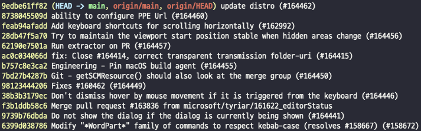
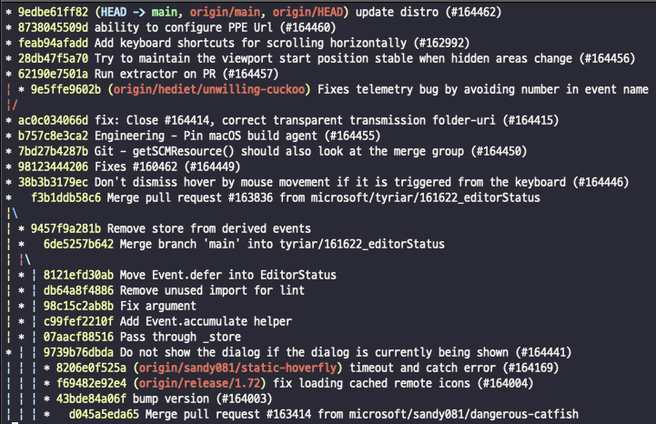
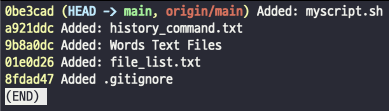
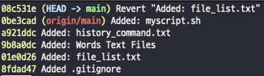
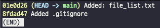

## 🧐 Git! 왜 다들 git을 쓸 줄 알아야한다고 하는거죠?

Git이 뭔데 다들 git을 외치는걸까요?

버전관리, 협업에 대해서 알고나면, git이 대해서 좀 더 친근하게 느껴지실 수 있을거에요 😉

> 버전관리, 파일관리
> 

흔히 우리는 학교 레포트 작성 혹은 ppt를 제작하면서 수많은 수정을 겪게 됩니다. 

가끔은 이전에 쓰던 내용,자료가 현재 파일에 덮어씌워지면서 날아가버리는 상황도 마주치게 되죠 😭

그래서 우린 이를 방지하기 위해서 중요한 수정, 데이터가 있는 자료들은 이전 버전을 남겨두면서 새로운 파일들을 계속 저장하곤 합니다. 그럼에도 우리의 실수로 파일이 하나씩 사라지는 엄청난 이슈를 겪기도 하죠,,

하지만 Git을 사용하게 된다면 이런 이슈를 미리 방지할 수 있답니다!
하나의 파일을 수정하고 작업이 마무리 되었다면 commit 이라는 명령어를 통해서 새로운 버전을 생성할 수 있게됩니다. 파일을 생성하듯 동일하게 버전에 이름을 부여할 수 있고, 추가적인 설명도 남길 수 있답니다.

- **그럼 그냥 파일을 날짜별로, 시간별로 관리하는거랑 별 차이가 없는걸요? 😕**

큰 차이점은 여러 버전의 파일을 직접 폴더 내에서 관리하는 것과 
보이는 것은 하나의 파일이지만 컴퓨터 특정 저장소 내에 여러 버전이 저장되어 있다는 점이죠.

여러 버전의 파일을 직접 폴더 내에 관리할 경우에는 어떤 폴더에 어떤 내용들이 있었는지 직접 열어보며 찾아야하고, 제목에 이를 반영하기에는 너무 길어서 가독성이 떨어지게 되죠

하지만 git을 활용한다면 git 내에 commit 이라는 명령어를 진행했던 기록을 보며, 각 버전별 내용을 보고 쉽게 다시 불러올 수 있답니다. 여러분이 보시는 파일은 1개에요! 다른 버전의 파일들은 git이 관리해주고 있답니다 😃

> 협업
> 

앞서 git을 통해서 버전관리에 대한 이점을 볼 수 있었는데요,

개발을 진행하면서 다른 노트북, 데스크탑에서 개발을 해야하는 경우나 다른 사람과 함께 개발을 진행해야하는 경우를 쉽게 볼 수 있을겁니다.

함께 개발을 한다. 를 함께 피피티를 만든다고 가정해보겠습니다.

기획을 디테일하게 하고, 어떤 부분을 누가 만들지 나누셨을거에요.

열심히 만든 결과물을 이제 팀원과 함께 하나의 파일로 합치는 과정을 진행할 때에 팀원에게 나의 파일을 보내주고 합치도록 하던가 혹은 팀원의 파일을 받아서 내가 합치는 절차를 진행하시게 되겠죠?

앗! 근데 문제가 발생했어요! 팀원이 만든 자료에 대해서 이해가 되지 않은 부분이 생겨 파일을 합치는데 팀원에게 계속 물어봐야하는 비효율이 발생하게 되었어요😭

- 이런 어려움을 git은 어떻게 해결해주고 있을까요?

앞선 예시에서 저희가 협업을 위해 필요한 조건을 알 수 있었습니다.

1. 파일 공유
2. 분업한 업무를 하나로 합치기

- **먼저 파일공유는 git으로 어떻게 할 수 있을까요?**

그러기 위해서는 우선 내 컴퓨터에 저장되어있는 버전들, 파일들을 다른 사람과 공유해야하는데요, 이를 위해 사용하는 것이 github입니다. github에 작업 중이던 파일들을 저장할 수 있으며, 물론! 버전들까지도 모두 저장을 할 수 있습니다 😊

github은 원격저장소로 저뿐만아니라 다른 사람들도 같이 접근을 할 수 있답니다.

그럼 협업을 위해서 github에 저장함으로 협업하기 위한 조건을 갖추게 되었답니다!

- **이제 파일 공유가 되었으니 우리는 분업한 업무를 하나로 합치는 과정만 해결하면 된답니다.**

github이라는 원격 저장소를 통해서 같이 작업해야하는 파일들을 가져와서 작업을 하게 되고 작업을 마친 뒤 동일하게 commit이라는 명령어를 통해서 새로운 버전을 만들게 됩니다. 그 후 새롭게 생성된 버전을 github에 있는 버전과 합치게 됩니다.

앗! 다른 팀원이 미리 변경된 내역을 github에 반영해둬서 제가 반영하려는 파일과 충돌이 생겼어요!!

괜찮아요! 충분히 해결할 수 있답니다.
git에는 각 버전별로 설명과 변경 내역을 볼 수 있다고 말씀드렸죠?! 다른 팀원을 변경내역을 참고해서 나의 코드를 같이 덮어주시면 된답니다~!

잘못 덮었다구요?! 걱정하지마세요! git에는 버전이 저장되어있어 다시 이전 버전으로 돌리고 덮으시면 됩니다!

### 그래서 우리는 git을 왜 알아야한다구요?!

- 그냥 파일을 관리하는 것보다 편하게 버전, 백업데이터를 관리할 수 있어요!
- 같이 협업하는데 git & github을 통해서 원격으로 파일을 공유하고, 수정할 수 있어요!

## Git은 무엇일까요?

Git은 **분산 버전 관리 시스템**으로, 프로젝트의 종류나 크기와 상관 없이 효율적으로 기록을 관리할 수 있는 시스템입니다!

무료이면서 오픈소스로 관리되기에 개발자들에게 많은 사랑을 받고 있으며, CLI/GUI 환경 모두를 지원합니다!

## 분산 버전 관리 시스템?

분산 버전 관리 시스템을 이해하기 전, 버전 관리 시스템이 무엇인지 이해해야 합니다!

**버전 관리 시스템**은 파일의 변화 정보를 시간에 따라 기록했다가, 필요한 경우 특정 시점의 버전을 다시 꺼내올 수 있는 시스템입니다. 이러한 버전 관리 시스템은 개발 분야 뿐만 아니라 컴퓨터에 존재하는 거의 모든 파일들에 대한 변경 사항을 기록할 수 있기 때문에 많은 분야에서 활용할 수 있습니다.

이러한 버전 관리 시스템의 초기에는 중앙 서버에서 모두 관리하고, 개별 컴퓨터에서 마지막 버전만 복사하는 중앙집중형으로 사용하였지만 중앙 서버에 문제가 발생하면 기록이 손실될 수 있다는 문제점이 존재했습니다.

이러한 문제점을 해결하기 위하여 기록을 **중앙 서버뿐만 아니라 파일을 사용하는 모든 컴퓨터에 저장**해 분산시켜 중앙 서버에 문제가 생겨도 쉽게 복구할 수 있는 **분산 버전 관리 시스템**이 등장하게 되었고, 그 중 가장 많이 사용되는 것이 오늘 소개할 ******Git******입니다!

## Git과 GitHub는 무슨 차이인가요?

앞서 설명드렸던 **분산 버전 관리 시스템**의 가장 큰 특징은 기록을 분산하여 저장한다는 것이었습니다.

그러나 단순히 개발자의 로컬 컴퓨터끼리만 분산해서 사용하게 될 경우 명확한 버전 관리 기준이 존재하지 않게 되어 서로 다른 기록들을 가지게 될 수 있기 때문에 **기준점을 잡아주는 서버가 필요**한데, GitHub는 이러한 서버의 역할을 해주는 플랫폼 중 가장 유명한 플랫폼이라고 볼 수 있습니다.

즉, Git은 분산 버전 관리 시스템을 제공하는 **소프트웨어**이고, ********GitHub는 Git 정보를 저장할 수 있는 클라우드 저장소 역할을 해주는 **플랫폼**이라고 볼 수 있습니다.

## Git을 더 잘 다루려면 어떻게 해야 할까요?

Git에는 다양한 명령어가 있지만 **commit, push, clone, pull 등의 기본 명령어**들만 사용하고 계신 경우가 많습니다!

그렇지만 버전 관리 시스템의 장점을 모두 활용하기 위해서는 다양한 명령어들을 같이 활용해야 합니다!

### Log 명령어의 정보를 활용하자!

버전 관리 시스템의 특징은 **변화 정보를 시간에 따라 기록**하는 것입니다! 기록을 확인할 수 있는 Log 명령어를 잘 활용해야 **빠르게 변경 기록을 추적**하고, **이전 내역으로 돌아갈 수 있습니다**.

Log 명령어에는 아래와 같이 다양한 정보들을 확인할 수 있는데, 하나하나가 중요한 정보들을 가지고 있으니, 어떤 의미인지 파악하는 것이 좋겠죠!


git log 명령어 입력 시 나오는 출력의 주요 구성요소 (microsoft/vscode)

그러나, 단순히 최근 몇 개의 Commit을 확인해서 이전 기록을 가져오고자 한다면 너무 많은 정보가 불필요할 수도 있겠죠!

그런 경우 아래처럼 `--oneline` 옵션을 이용하면, **Commit의 고유 ID와 메시지**만 나오기 때문에 빠르게 원하는 정보를 찾을 수 있습니다!

```bash
git log --oneline
```



git log —oneline 명령어 입력 시 나오는 출력 (microsoft/vscode)

여러 Branch를 거쳐서 최종적으로 만들어진 Commit의 경우, 전체 흐름을 참고해야 할 수 있습니다!

이때는 아래처럼 `--oneline` `--decorate` `--graph` `--all` 옵션을 이용하면, **각 Commit들이 어떤 Branch에서 갈라져 나오고, 합쳐졌는지 왼편에서 그림으로 확인**해볼 수 있습니다.

```bash
git log --oneline --decorate --graph --all
```



git log —oneline —decorate —graph —all 명령어 입력 시 나오는 출력 (microsoft/vscode)

### 협업하는 도중 이전으로 되돌리려면 Reset이 아닌 Revert를 사용하자!

Reset 명령어를 사용하면 손쉽게 이전의 Commit 내용으로 돌아갈 수 있습니다. 그러나 **Reset 명령어는 지정한 Commit 이후의 모든 내역이 삭제**되기 때문에 협업하고 있는 다른 개발자가 동일 Branch를 사용하고 있을 경우 서로 기록이 달라져 에러가 발생하는 원인이 됩니다!

하지만 **Revert는 이전 내용으로 복구하는 새로운 Commit을 만들어서 복원**하기 때문에 이전의 기록이 유지되어 문제가 발생하지 않습니다!



원본 Git Log



원본의 4번째 Commit을 Revert 했을 때의 Git Log



원본의 4번째 Commit을 Reset 헀을 때의 Git Log

## 참고자료

- Pro Git Second Edition (by Scott Chacon, Ben Straub), [https://git-scm.com/book/ko/v2](https://git-scm.com/book/ko/v2)
- [Git] Git 제대로 알고 사용하기 - 2, [https://programforlife.tistory.com/100](https://programforlife.tistory.com/100)
- microsoft/vscode, [https://github.com/microsoft/vscode](https://github.com/microsoft/vscode)
- git revert 사용법: 이미 커밋한 내용을 되돌리는 방법, [https://www.lainyzine.com/ko/article/git-revert-reverting-commit-in-git-repository/](https://www.lainyzine.com/ko/article/git-revert-reverting-commit-in-git-repository/)
- git을 왜 알아야한다구요? [https://kimvampa.tistory.com/118](https://kimvampa.tistory.com/118)
- [https://luv-n-interest.tistory.com/831](https://luv-n-interest.tistory.com/831)
- [https://velog.io/@hyun0310woo/git](https://velog.io/@hyun0310woo/git)